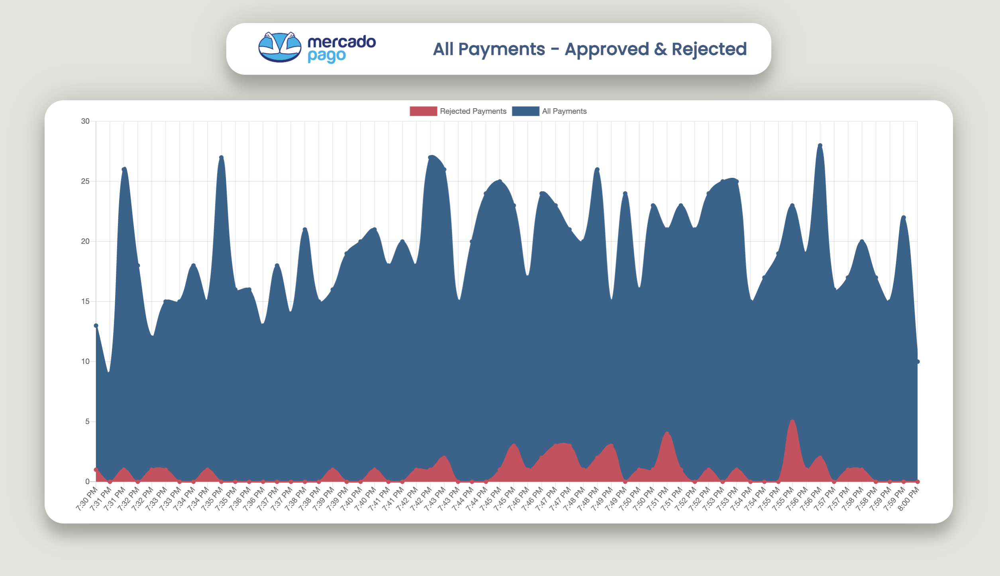

# Mercadopago Payments Monitor

`mercadopago-payments-monitor` is a real-time monitor where you can supervise your amount of payments received with MercadoPago as payment method.

 <br />

After configuring your account access_token, you will be able to keep an eye on your approved & rejected payments. You will be able to know when your account is blocked or if your payment-procesor server stops working. This service will help you to react in real-time.

More information in [MercadoPago Devsite](https://www.mercadopago.com.ar/developers)

## Getting started

### Requirements
You'll need to have Node v7.6+ installed, which includes support for `async` / `await`.

### Set up the monitor
Clone the project repository, and create a configuration for your MercadoPago account. You will need to fill config.js with your access_tokens. Get it from [here](https://www.mercadopago.com.ar/developers/panel/credentials)

### Start the monitor

```
npm install
npm start
```

If you are testing local, you should be accessing it in `http://localhost:3000/allpayments`.

#### REMEMBER: 
This service must be used just in internal infrastructure. Avoid exposing all payments information into a public server.
## Credits

- Code: [Nicolas Fernandez](https://www.instagram.com/fernandeznicolas/)